# Portal Transparencia Activa — Municipalidad de Santo Domingo (MU309)

Portal web de Transparencia Activa que cumple la Ley N° 20.285, utilizando los estándares del Kit Digital de Gobierno de Chile y una arquitectura de navegación inspirada en el SII (Servicio de Impuestos Internos).

## User Review Required

> [!IMPORTANT]
> **Decisión de stack tecnológico**: Dado que el Kit Digital de Gobierno se basa en **Bootstrap 4** con CSS/JS vanilla (paquete `@gobdigital-cl/gob.cl`), la propuesta es construir el portal como un sitio **HTML/CSS/JS estático multi-página** que incorpora directamente el Framework Kit Digital vía CDN. Esto permite cumplimiento fiel del estándar sin overhead de frameworks JS como React. ¿Prefiere mantener este enfoque o migrar a React/Vite con el kit como dependencia NPM?

> [!WARNING]
> **Datos de prueba**: Las capturas proporcionadas del SII son referencias de diseño. Los datos reales de transparencia de Santo Domingo (personal, remuneraciones, licitaciones) se incluirán como datos JSON de ejemplo para demostrar la funcionalidad de tablas dinámicas. ¿Dispone de archivos CSV/Excel con datos reales para integrar?

## Open Questions

1. **Logo municipal**: ¿Dispone del logo oficial de la Municipalidad de Santo Domingo en formato SVG/PNG para incluir en el header?
2. **Dominio**: ¿El portal se alojará como subdominio (ej. `transparencia.santodomingo.cl`) o como sección del sitio principal (`santodomingo.cl/transparencia`)?
3. **Datos de personal**: ¿Tiene una fuente de datos actualizada (API, CSV) con la nómina de funcionarios de planta, contrata y honorarios?
4. **Mercado Público**: ¿Desea integración directa con la API de Mercado Público para mostrar licitaciones en tiempo real?

---

## Arquitectura General

### Stack Tecnológico

| Componente | Tecnología | Justificación |
|---|---|---|
| **Estructura** | HTML5 semántico | Estándar Kit Digital, accesibilidad |
| **Estilos** | Framework Kit Gobierno (`gob.cl.css`) + CSS custom | Cumplimiento normativa visual |
| **Tipografía** | Roboto + Roboto Slab (Google Fonts) | Definido por Kit Digital |
| **Iconos** | Material Icons + SVG custom | Compatible con Kit Digital |
| **JavaScript** | Vanilla JS (ES6+) | Tablas dinámicas, filtros, búsqueda |
| **Dependencias** | Bootstrap 4, jQuery, Popper.js | Requeridos por Framework Kit |
| **Datos** | JSON estático | Simula fuentes de datos reales |

### Paleta de Colores (Kit Digital)

| Rol | Color | Hex | Clase CSS |
|---|---|---|---|
| **Primario** | Azul Gobierno | `#006FB3` | `.bg-primary` / `.text-primary` |
| **Secundario** | Rojo Chile | `#FE6565` | `.bg-secondary` / `.text-secondary` |
| **Terciario** | Azul Oscuro | `#0A132D` | `.bg-tertiary` |
| **Neutral** | Gris claro | `#EEEEEE` | `.bg-neutral` |
| **Texto principal** | Negro-gris | `#212529` | Default |
| **Texto párrafo** | Gris medio | `#4A4A4A` | `.text-muted` |

### Tipografía

- **Títulos**: `Roboto Slab`, 400 weight — tamaños desde 2.4rem (h1) hasta 1.125rem (h6)
- **Cuerpo**: `Roboto`, 400 weight — 1rem base, color `#212529`
- **Párrafos**: `Roboto`, 400 — 1rem, color `#4A4A4A`
- **Detalles**: `Roboto`, 400 — 0.6875rem

---

## Mapa del Sitio

```mermaid
graph TD
    A["🏛️ Inicio Portal Transparencia"] --> B["📋 Actos y Resoluciones"]
    A --> C["👥 Personal y Remuneraciones"]
    A --> D["🛒 Compras y Licitaciones"]
    A --> E["💰 Transferencias y Subvenciones"]
    A --> F["📝 Trámites y Servicios"]
    A --> G["📊 Presupuesto"]
    A --> H["🏗️ Estructura Orgánica"]
    A --> I["📜 Marco Normativo"]
    A --> J["🎯 Subsidios y Beneficios"]
    A --> K["🤝 Participación Ciudadana"]
    A --> L["🔍 Auditorías"]
    A --> M["🏢 Participación en Entidades"]
    
    C --> C1["Planta"]
    C --> C2["Contrata"]
    C --> C3["Honorarios"]
    C --> C4["Escala Remuneraciones"]
    
    D --> D1["Licitaciones Vigentes"]
    D --> D2["Historial Compras"]
    D --> D3["Trato Directo"]
    
    B --> B1["Decretos Alcaldicios"]
    B --> B2["Ordenanzas"]
    B --> B3["Resoluciones"]
```



### Principio de Navegación "2 Clics" (Inspirado en SII)

| Nivel | Contenido | Patrón UX |
|---|---|---|
| **Nivel 0** | Dashboard mosaico con 12 categorías | Cards con iconos y contadores |
| **Nivel 1** | Vista detalle de categoría con subtabs | Tabs + tabla dinámica con filtros |
| **Nivel 2** | Documento/detalle específico | Modal o vista inline expandible |

---

## Proposed Changes

### Estructura de Archivos del Proyecto

```
municipalidad/
├── index.html                    # Dashboard principal (mosaico)
├── pages/
│   ├── personal.html             # Personal y Remuneraciones
│   ├── actos.html                # Actos y Resoluciones
│   ├── compras.html              # Compras y Licitaciones
│   ├── transferencias.html       # Transferencias y Subvenciones
│   ├── tramites.html             # Trámites y Servicios
│   ├── presupuesto.html          # Presupuesto Municipal
│   ├── estructura.html           # Estructura Orgánica
│   ├── normativa.html            # Marco Normativo
│   ├── subsidios.html            # Subsidios y Beneficios
│   ├── participacion.html        # Participación Ciudadana
│   ├── auditorias.html           # Auditorías
│   └── entidades.html            # Participación en Entidades
├── css/
│   └── custom.css                # Estilos custom sobre Kit Digital
├── js/
│   ├── app.js                    # Lógica principal, routing SPA-like
│   ├── tables.js                 # Motor de tablas dinámicas
│   └── search.js                 # Buscador global
├── data/
│   ├── personal.json             # Datos ejemplo funcionarios
│   ├── actos.json                # Datos ejemplo actos/resoluciones
│   ├── compras.json              # Datos ejemplo licitaciones
│   ├── transferencias.json       # Datos ejemplo transferencias
│   └── presupuesto.json          # Datos ejemplo presupuesto
└── assets/
    ├── icons/                    # SVG icons para categorías
    └── img/                      # Imágenes del portal
```

---

### Componente 1: Header Institucional + Barra de Gobierno

#### [NEW] index.html — Dashboard Principal

El archivo central del portal. Incluye:

1. **Barra superior de Gobierno** (franja azul/rojo/blanco como en Kit Digital)
2. **Header institucional** con logo municipal, nombre completo y búsqueda
3. **Breadcrumb** de navegación
4. **Dashboard mosaico** (grid 3×4 de cards) con las 12 secciones de Transparencia Activa
5. **Footer** institucional con datos de contacto y logo de Gobierno

**Patrón SII aplicado**: El dashboard reproduce la disposición de "tablero de control" del SII, donde cada card funciona como un acceso directo con:
- Icono descriptivo SVG
- Título de la sección
- Contador de documentos disponibles
- Fecha de última actualización
- Hover con elevación y animación suave

---

### Componente 2: Sistema de Cards Mosaico (Estilo SII)

#### [NEW] css/custom.css — Estilos Personalizados

Extiende el Kit Digital con:

- **Grid responsivo** para el mosaico (CSS Grid + Bootstrap grid)
- **Card hover effects** con `transform: translateY(-4px)` y `box-shadow` aumentado
- **Color coding** por categoría (borde izquierdo de color por sección)
- **Barra de progreso** indicando completitud de datos publicados
- **Micro-animaciones** en transiciones entre páginas
- **Tabla responsive** con scroll horizontal en mobile
- **Sticky header** en tablas largas
- **Chips/tags** de estado (Vigente, Archivado, En Proceso)

---

### Componente 3: Motor de Tablas Dinámicas

#### [NEW] js/tables.js — Tablas Interactivas

Motor JavaScript vanilla que transforma los datos JSON en tablas dinámicas con:

- **Ordenamiento** por columna (asc/desc) con indicador visual
- **Filtrado** por texto libre y por columna
- **Paginación** (10/25/50/100 registros por página)
- **Exportación** CSV y PDF
- **Búsqueda** en tiempo real con debounce
- **Responsive**: Columnas colapsables en mobile con expand/collapse
- **Formato monetario**: Valores en CLP con separador de miles
- **RUT formatter**: Validación y formato automático de RUT

---

### Componente 4: Páginas de Detalle por Sección

#### [NEW] pages/personal.html — Personal y Remuneraciones

La sección más compleja. Implementa:

- **Tabs** (Kit Digital): Planta / Contrata / Honorarios / Escala
- **Buscador de funcionarios** por nombre o RUT
- **Tabla con columnas**: Nombre, Cargo, Grado, Calificación, Remuneración Bruta, Remuneración Líquida, Tipo contrato, Fecha ingreso
- **Filtros laterales**: Por dirección/departamento, rango salarial, tipo de contrato
- **Resumen estadístico** tipo dashboard: Total funcionarios, promedio remuneraciones, distribución por tipo

#### [NEW] pages/compras.html — Compras y Licitaciones

- **Timeline visual** de licitaciones vigentes
- **Cards** estilo Mercado Público con: ID licitación, objeto, monto estimado, fecha cierre, estado
- **Filtros**: Por año, tipo (licitación pública, privada, trato directo), monto, estado
- **Link directo** a Mercado Público para cada licitación

#### [NEW] pages/presupuesto.html — Presupuesto Municipal

- **Gráfico de barras** (CSS puro, inspirado en el desglose del SII) mostrando distribución del gasto
- **Comparativa año a año** con barras horizontales
- **Tabla detallada** con ítems presupuestarios, montos asignados y ejecutados
- **Porcentaje de ejecución** con barra de progreso visual

#### [NEW] pages/estructura.html — Estructura Orgánica

- **Organigrama interactivo** con CSS (tree layout)
- **Cards de perfil** (componente Kit Digital) para autoridades principales
- **Descripción de funciones** expandible por unidad

#### [NEW] pages/actos.html, transferencias.html, tramites.html, etc.

Cada página sigue el mismo patrón:
1. Breadcrumb → Título → Descripción legal
2. Filtros superiores (año, tipo, búsqueda)
3. Tabla dinámica con datos
4. Paginación
5. Exportación

---

### Componente 5: Buscador Global

#### [NEW] js/search.js — Búsqueda Transversal

- **Barra de búsqueda** en el header (estilo SII)
- Busca en todos los JSON de datos
- Resultados agrupados por sección
- Highlight del término buscado
- Sugerencias predictivas

---

### Componente 6: Datos de Ejemplo

#### [NEW] data/personal.json

Datos simulados de ~50 funcionarios con estructura:
```json
{
  "funcionarios": [
    {
      "rut": "12.345.678-9",
      "nombre": "Juan Pérez González",
      "cargo": "Director SECPLA",
      "grado": "4",
      "tipo": "planta",
      "direccion": "Secretaría Comunal de Planificación",
      "remuneracionBruta": 2850000,
      "remuneracionLiquida": 2100000,
      "fechaIngreso": "2019-03-15"
    }
  ]
}
```

#### [NEW] data/compras.json, data/actos.json, etc.

Datos simulados siguiendo el mismo patrón para cada sección.

---

## Guía de Estilo: Arquitectura SII para Rendición de Cuentas

### ¿Por qué el modelo SII?

El SII es el servicio público digital con mayor penetración en Chile (~8M de usuarios). Su arquitectura de dashboard funciona porque:

1. **Visibilidad inmediata**: El ciudadano ve todas las opciones disponibles sin necesidad de menús desplegables o navegación profunda
2. **Iconografía clara**: Cada trámite tiene un ícono reconocible que reduce la carga cognitiva
3. **Contadores activos**: Mostrar "15 documentos" o "Actualizado: Marzo 2026" genera confianza y demuestra que la información está vigente
4. **Jerarquía visual**: Las cards más importantes (ej. Personal) pueden ocupar más espacio en el grid

### Aplicación al Portal de Transparencia

| Principio SII | Implementación Transparencia |
|---|---|
| Dashboard de trámites | Grid 3×4 de categorías Ley 20.285 |
| Sidebar lateral | Menú lateral con accesos directos por sección |
| Tablas de datos tributarios | Tablas dinámicas de personal/compras/presupuesto |
| Alertas y notificaciones | Tags de estado (Vigente/Archivado) y fechas |
| Navegación por breadcrumbs | Breadcrumbs en todas las páginas internas |
| Búsqueda de contribuyentes | Buscador de funcionarios por nombre/RUT |

---

## Verification Plan

### Automated Tests

1. **Validación HTML**: `npx html-validate *.html` para verificar semántica HTML5
2. **Accesibilidad**: Verificación WAVE/axe-core para cumplir WCAG 2.1 AA
3. **Responsive**: Prueba visual en viewports 320px, 768px, 1024px, 1440px via browser tool
4. **Performance**: Lighthouse audit para verificar puntuaje > 90 en Performance y Accessibility

### Manual Verification

1. Abrir `index.html` en navegador y verificar:
   - Barra de gobierno visible con colores institucionales
   - Dashboard mosaico con 12 cards funcionales
   - Navegación a cada sección en ≤2 clics
   - Tablas dinámicas con filtrado, ordenamiento y paginación
   - Diseño responsivo en mobile
2. Verificar que todos los componentes visuales sigan el Kit Digital (colores, tipografía, cards, buttons)
3. Verificar breadcrumbs y navegación back/forward
